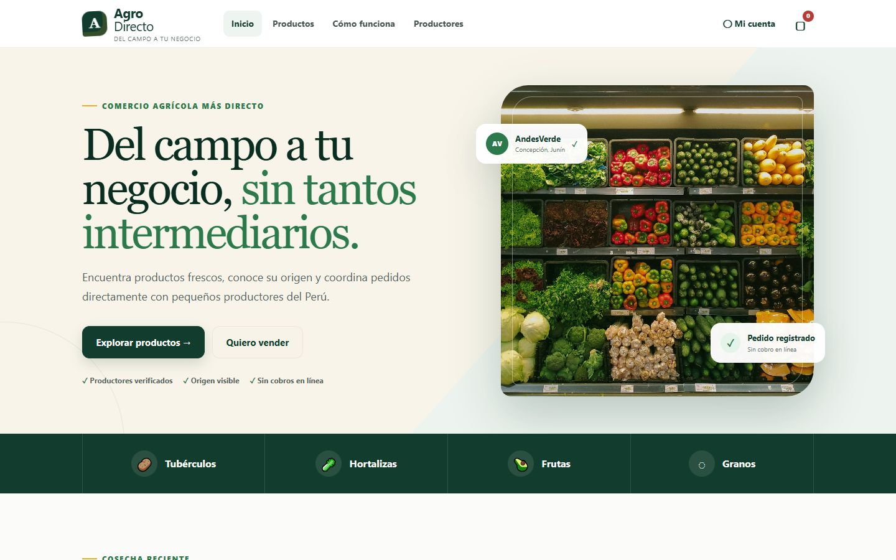
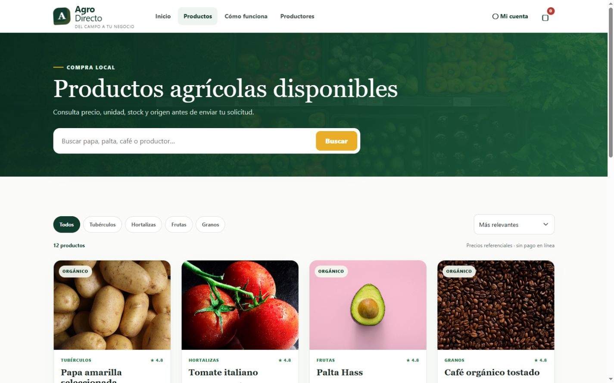
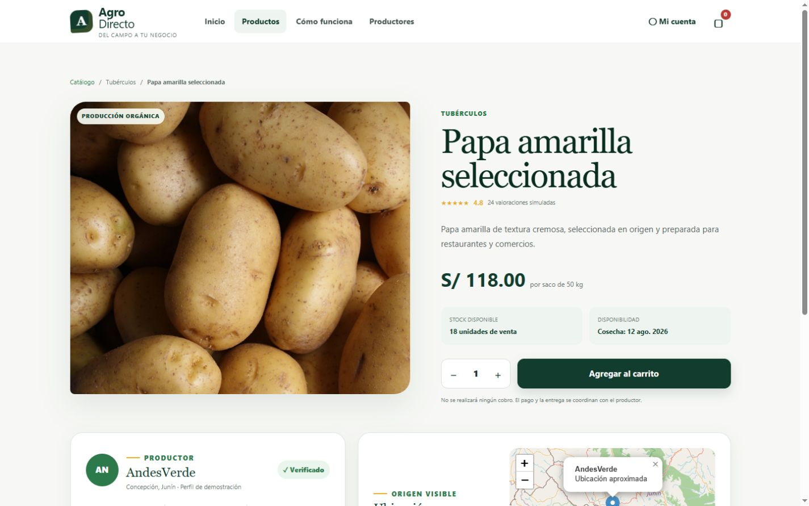
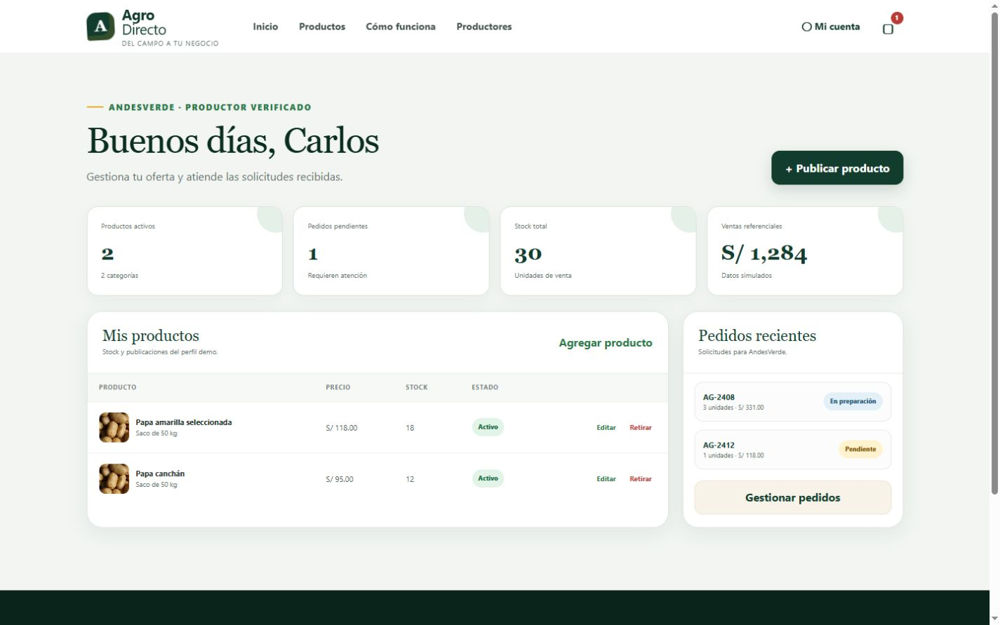
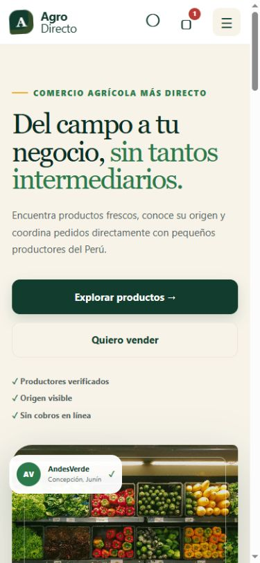

# AgroDirecto

MVP web académico que conecta productores agrícolas con compradores locales. Permite descubrir productos, conocer su procedencia, preparar un pedido y coordinarlo directamente con el productor, sin pagos reales ni intermediación financiera.

Proyecto desarrollado para el **Avance 1 — Semana 8** del curso Desarrollo Full Stack de la Universidad Tecnológica del Perú.



## Funcionalidades

- Doce pantallas navegables y adaptables a dispositivos móviles.
- Perfiles diferenciados de comprador, productor y administrador.
- Registro e inicio de sesión simulados para demostración.
- Catálogo con búsqueda, filtros y fichas de producto.
- Dieciséis productos iniciales y alta, edición, borrador, retiro y republicación de productos.
- Favoritos persistentes y filtro de productos guardados.
- Ubicación aproximada mediante Leaflet y OpenStreetMap.
- Carrito sujeto a la regla de un solo productor por pedido.
- Confirmación de pedidos sin cobros ni pasarela real.
- Seguimiento, cancelación y cambio de estado de pedidos con reposición de stock.
- Paneles funcionales de comprador, productor y administrador.
- Persistencia local de productos, borradores, favoritos, carrito, pedidos y sesión mediante `localStorage`.
- Navegación inferior específica para teléfonos y controles táctiles.

## Alcance del Avance 1

Esta versión valida la experiencia, la navegación y las principales reglas del negocio. No incluye backend multiusuario, base de datos remota, pagos reales, inteligencia artificial ni hardware.

| Incluido                        | Planificado según las instrucciones del curso |
| ------------------------------- | --------------------------------------------- |
| Frontend navegable y responsive | Spring Boot y backend al 60% en el Avance 2   |
| Datos de demostración           | API REST o Spring MVC con Thymeleaf           |
| Persistencia local              | Base de datos mediante Spring Data            |
| Mapa gratuito                   | Persistencia multiusuario                     |
| Roles simulados                 | Spring Security en la entrega final           |

## Tecnologías

- React 19 y TypeScript.
- Vinext y Vite.
- Bootstrap 5 y CSS personalizado.
- Leaflet y OpenStreetMap.
- Node.js y pnpm.

## Organización del código

El código de la aplicación está dentro de `src/`: `app` contiene la entrada, `screens` las pantallas, `components` los elementos reutilizables y `hooks` el estado y las acciones compartidas. Los tipos, datos iniciales, servicios y estilos tienen sus propias carpetas.

Consulta [la guía de estructura](docs/estructura.md) para saber dónde modificar cada parte y cómo se conectan los módulos.

## Evidencias

| Catálogo                                                   | Detalle y mapa                                                             |
| ---------------------------------------------------------- | -------------------------------------------------------------------------- |
|  |  |

| Panel del productor                                             | Vista móvil                                               |
| --------------------------------------------------------------- | --------------------------------------------------------- |
|  |  |

Las trece capturas del prototipo están disponibles en [`docs/screenshots`](docs/screenshots).

## Instalación

Requisitos: Node.js 22.13 o superior y pnpm.

```bash
pnpm install
pnpm run dev
```

Abrir `http://localhost:3000/`.

## Verificación

```bash
pnpm test
pnpm lint
```

La compilación de producción y las pruebas de renderizado se encuentran validadas. El lint no presenta errores; conserva advertencias informativas por el uso deliberado de imágenes HTML locales en el prototipo.

## Equipo

- Jaime Israel Aramburu Condori.
- Leslie Liliana Cabrera Luley.
- Jose Antonio Morote Sanchez.
- Andrés Ronaldo Bayona Manrique.

Curso: Desarrollo Full Stack — UTP, sección 45554, 2026.
